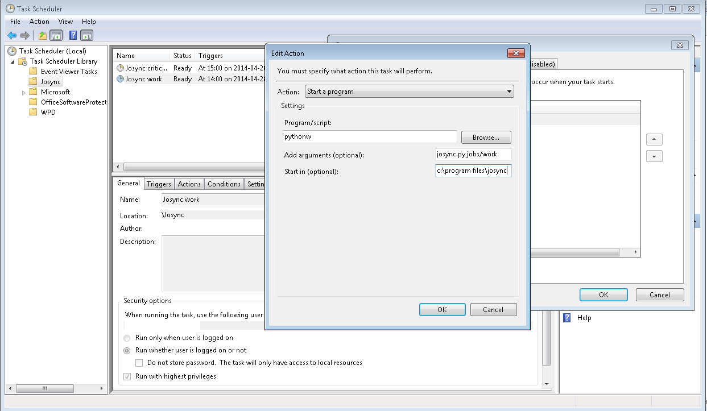

***************
Getting started
***************

Prerequisites
=============

Running Josync 1.x requires, in addition to Josync itself,
	* Python 2.7,
		* Download and install from https://www.python.org/downloads/
	* Cygwin with ``rsync`` and ``cygpath`` binaries,
		*	Download and install from http://cygwin.com/install.html

			Cygwin has its own installer offering many, many packages. For Josync, you need only to check ``rsync`` in the category ``net``. The installer will find the dependencies automatically.

	* A copy of ``vshadow.exe`` for your operating system.
		* Either (recommended)
			* download the zip with binaries from the 1.0 release at https://github.com/jeinarsson/josync/releases/tag/1.0 and find the version appropriate for your OS.
		* Or 
			* install the Windows SDK for your Windows version and find ``vshadow.exe`` from the Samples section.

Getting Josync
==============

Either
	* Download the latest 1.x release zip file from https://github.com/jeinarsson/josync/releases/
Or, if you're familiar with git, checkout the ``stable_1`` branch.
	* ``git clone https://github.com/jeinarsson/josync.git -b stable_1``

Basic configuration
===================

Josync reads its configuration from a JSON-formatted files. 

To get started Josync needs to know where to find the external binaries. By default Josync looks for them in the current working directory. If they are available elsewhere, specify the corresponding paths in ``default.josync-config``. 

For example::

	{
	    "cygwin_bin_path": "C:/cygwin64/bin",
	    "vshadow_bin": "d:/projects/josync/ext/vshadow.exe",
	}

.....

	Note: you may also create a file called ``user.josync-config`` containing your settings. Any configuration options specified there will override the options in ``default.josync-config``. We use this to avoid Git replacing our settings.

Running a basic sync job
========================

Josync reads job descriptions from JSON-formatted job-files.

Josync 1.x contains a sample job description in ``syncjob-example.josync-job``, it looks like this::

	{
	    "type": "sync",
	    "sources": [
	    		{"path": "d:/phd", "excludes": []},
	    		{"path": "d:/projects", "excludes": ["*.pyc;*.pyo"]}
	    	],
	    "global_excludes": ["*.hdf5"],
	    "target": "g:/Josync Backups/work"
	}

Job descriptions consist of a job type, a list of source paths and a target path. Optionally, a job description may contain exclusion patterns. Excludes may be specified either globally or per source.

Modify the job description to make sense on your system, and try running this job::
	
	python josync.py syncjob-example

Scheduling
==========

When we schedule Josync to run using the built-in Task Scheduler in Windows, we execute with ``pythonw.exe`` instead of ``python.exe``. The only difference is that ``pythonw.exe`` does not open a command-line window, but runs quietly in the background. The "Action" of the task can look like this (click for larger version):

*Screenshot of Task Scheduler*

Next steps
==========

Now that Josync 1.0 runs you probably want to
	* check out :doc:`notifications`,
	* know more about and configure the log files written by Josync: :doc:`logging`,
	* read the details about the available :doc:`job types<jobs>`